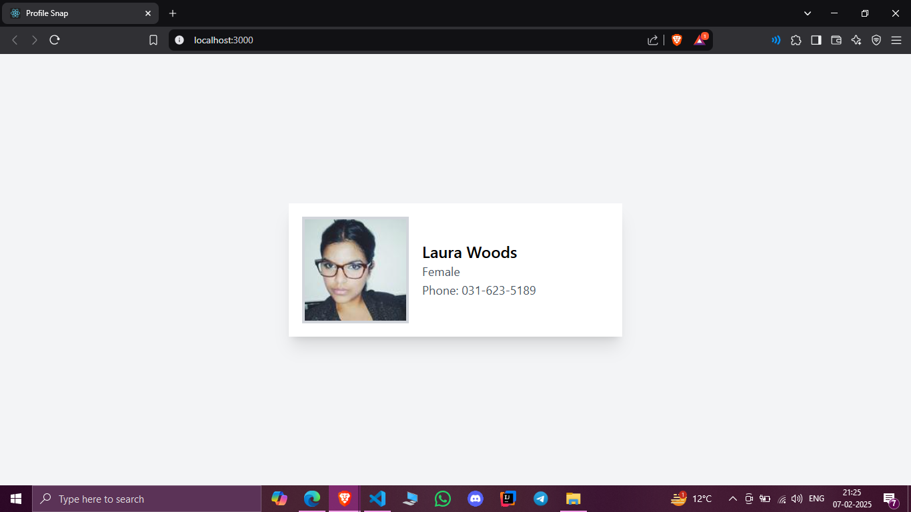

# Profile Display Website

## Project Overview
This React application fetches user data from the RandomUser API and displays it in a neatly styled profile card. The project is designed as part of an assignment and adheres to the provided wireframe design.

## Features
- Fetches user data from [RandomUser API](https://randomuser.me/api/?page=1&results=1&seed=abc).
- Displays user information such as name, gender, and phone number.
- Includes user profile picture.
- Clean and responsive UI built with Tailwind CSS.

## Installation
To run this project locally, follow these steps:

1. Clone the repository:
   ```bash
   git clone <repository-url>
   ```

2. Navigate to the project directory:
   ```bash
   cd display-profile
   ```

3. Install dependencies:
   ```bash
   npm install
   ```

4. Start the development server:
   ```bash
   npm run start
   ```

The app will be available at `http://localhost:3000`.

## Project Structure
```
src/
├── App.js       # Main component fetching and displaying user data
├── index.js     # Entry point of the application
├── index.css    # Tailwind CSS configuration
└── assets/      # Static assets (if any)
```

## Technologies Used
- **React**: Front-end library for building user interfaces.
- **Axios**: HTTP client for API requests.
- **Tailwind CSS**: Utility-first CSS framework for styling.

## API Details
This project uses the following API endpoint to fetch user data:
```
https://randomuser.me/api/?page=1&results=1&seed=abc
```

## Design Considerations
- The layout closely follows the provided wireframe.
- Proper spacing, font hierarchy, and responsive styling were implemented using Tailwind CSS.
- The profile card features a rounded profile image, user details, and a clean design.

## Screenshots

---

Thank you for reviewing this project!